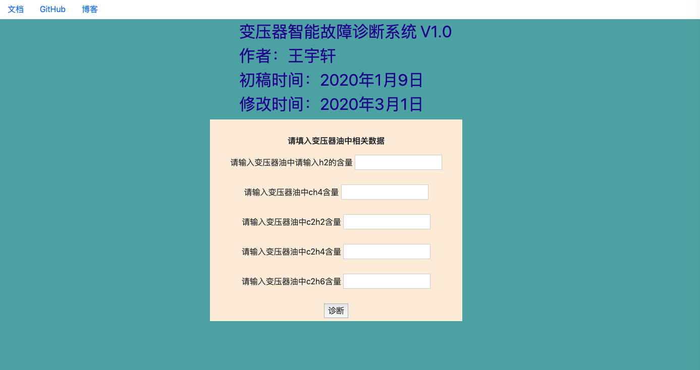
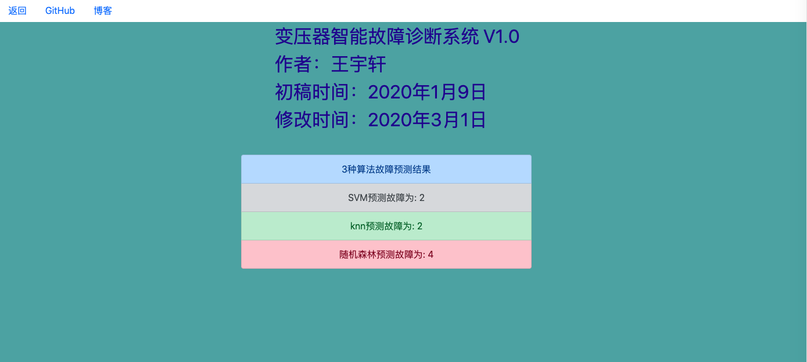

# 人工智能作业

### 题目：变压器故障诊断系统 V1.0

学生：王宇轩

学号：1912301053
[toc]
#### 程序讲解

#### 1.1 开发环境 macOS mojave 10.14.6    win10和ubuntu测试可用
##### 必备的python库
+ flask
+ flask_wtf
+ scikit-learn
+ pandas
+ numpy
##### 各文件夹的作用
+ dataset文件夹存放训练算法的数据
+ templates文件夹存放html模板
+ code文件夹存放代码
+ img文件夹存放README的图片
##### 本软件设计到的框架
+ 前端：HTML/CSS/bootstrap
+ 后端：flask, flask_wtf，功能简单，没有调用mysql数据库
+ 算法：pandas, numpy, scikit-learn

#### 1.2 本程序分为三个算法：

+ k-NearestNerghbors(knn)
+ SVM
+ 随机森林

#### 1.3 变压器只能故障诊断系统详解


1. 运行diagnosissys.py文件
2. 在首页中填写变压器油中溶解气体的数据，后端会根据三种算法来诊断变压器的故障，一共有6种故障，用1~6表示。
3. 点击诊断按键，会进行计算，计算速度很快。
4. 进入诊断页面过后会显示三种算法根据输入的气体诊断的结果。
5. 左上角有返回按键，可以返回主页，有帮助文档，右边是我的GitHub和博客。

#### 1.4 程序放在我的GitHub https://github.com/sometimesstudy/AIwork  上面,下载指令

````shell
git clone https://github.com/sometimesstudy.git
````
**第一次前后端结合，代码有点乱不规范，前端页面不太好看，希望老师能谅解**


